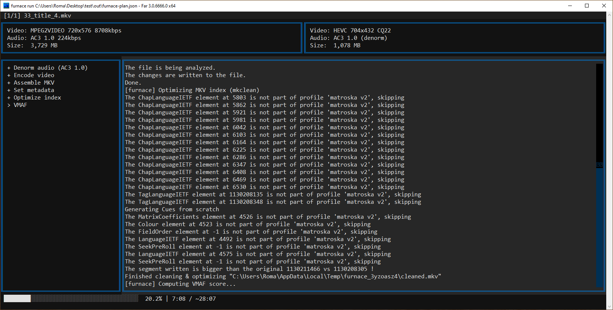

# Furnace

Batch video transcoder for home archival. Scans your movie collection, lets you pick tracks in a TUI, saves a JSON plan, then encodes everything with NVENC.

## Why Furnace

- **Plan, review, then run** — choose tracks and preview in a TUI, save a JSON plan you can inspect or edit before hours of encoding
- **Resumable** — failed jobs retry on next run, plan updated atomically after each job
- **Auto quality** — CQ value interpolated by pixel area, no manual tuning across SD/720p/1080p/4K
- **Disc demux** — Blu-ray (BDMV) and DVD (VIDEO_TS) fed straight into the pipeline with playlist/title selection
- **Anamorphic SAR fix** — detects and corrects wrong sample aspect ratio on DVD sources
- **Auto deinterlace** — detects interlaced content from the video stream and applies bwdif automatically
- **Smart crop** — black bars detected at 5 points across the timeline, auto-applied
- **mpv preview** — audition audio tracks, check subtitles, or preview video right from the TUI before committing
- **Satellite files** — external audio and subtitle files next to the video are picked up as extra tracks automatically

## Workflow

```
furnace plan <source> -o <output> --audio-lang rus,eng --sub-lang rus,eng
# -> opens TUI for track selection -> saves furnace-plan.json

furnace run furnace-plan.json
# -> encodes all pending jobs with live progress TUI
```



## Requirements

- Python 3.13+
- [ffmpeg / ffprobe](https://ffmpeg.org)
- [MKVToolNix](https://mkvtoolnix.download) (mkvmerge, mkvpropedit)
- [eac3to](https://forum.doom9.org/showthread.php?t=125966)
- [qaac64](https://github.com/nu774/qaac)
- [mkclean](https://www.matroska.org/downloads/mkclean.html)
- [mpv](https://mpv.io) (track preview)
- [MakeMKV](https://www.makemkv.com) (DVD demux)

## Install

```bash
uv pip install .
```

## Configuration

Copy [`furnace.toml.example`](furnace.toml.example) to `furnace.toml` and set paths to your tools. Searched in order: `--config` flag, current directory, `%APPDATA%\furnace\`.

## Usage

Plan with dry run (no TUI, just print what would happen):
```bash
furnace plan D:\Movies -o E:\Encoded --audio-lang jpn --sub-lang eng --dry-run
```

Plan and encode:
```bash
furnace plan D:\Movies -o E:\Encoded --audio-lang rus,eng --sub-lang rus,eng
furnace run E:\Encoded\furnace-plan.json
```

Enable VMAF quality scoring:
```bash
furnace plan D:\Movies -o E:\Encoded --audio-lang eng --sub-lang eng --vmaf
```
