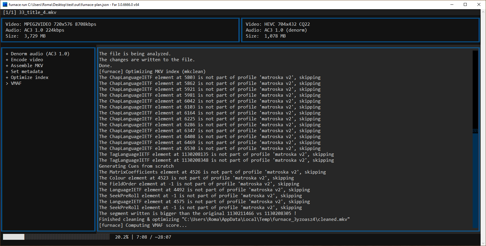

# Furnace

Batch video transcoder for home archival. Scans your movie collection, lets you pick tracks in a TUI, saves a JSON plan, then encodes everything to 10-bit AV1 — NVENC (NVIDIA hardware) for speed, with grainy SD film routed to SVT-AV1 so its grain survives.

## Why Furnace

- **Plan, review, then run** — choose tracks and preview in a TUI, save a JSON plan you can inspect or edit before hours of encoding
- **Resumable** — failed jobs retry on next run, plan updated atomically after each job
- **Live progress on every long step** — up-front analysis runs the batch in parallel; ffmpeg extraction, eac3to, qaac, mkvmerge and the encoder all stream into one unified progress bar; no more silent multi-gigabyte waits
- **10-bit AV1 output** — always main10, no manual quality tuning across SD/720p/1080p/4K
- **Film-grain preservation** — grainy SD film is auto-detected and encoded with SVT-AV1, which keeps the grain in the bitstream (still hardware-decodable), instead of NVENC, which smooths it into waxy faces; confirm or override per file with `G` in the selector
- **Soft-telecine aware** — detects 2:3 pulldown on NTSC DVDs, encodes the coded film frames and pins the true film rate so playback isn't sped up or desynced
- **Disc demux** — Blu-ray (BDMV) and DVD (VIDEO_TS) fed straight into the pipeline with playlist/title selection
- **Anamorphic SAR fix** — detects and corrects wrong sample aspect ratio on DVD sources
- **Dolby Vision** — Profile 7 FEL (converted to P8.1) and Profile 8 MEL, re-tagged as AV1 Profile 10.1, RPU handled via dovi_tool
- **HDR10 passthrough** — mastering display, content light level, BT.2020/PQ preserved through encode
- **Auto deinterlace** — nnedi (neural network); HD interlaced content is always deinterlaced, SD is confirmed with idet before committing
- **Smart crop** — black bars detected automatically across the timeline
- **Target-quality encoding** — always on, no flag: before each encode Furnace probes short windows at several quality settings and interpolation-searches the one that hits a perceptual target — QVBR against CVVDP (HDR) or SSIMULACRA2 (SDR) on the NVEnc path, CRF against worst-case SSIMULACRA2 on the SVT-AV1 grain path — then encodes at it, full speed, with no metrics slowing the final pass. The chosen setting is cached to the plan so re-runs skip the search
- **mpv preview** — audition audio tracks, check subtitles, or preview video right from the TUI before committing
- **Per-track downmix** — fold 7.1 or 5.1 into stereo or 5.1 from the track selector, useful when the multichannel mix is a fake upmix or the movie is dialogue-heavy
- **Satellite files** — external audio and subtitle files next to the video are picked up as extra tracks automatically
- **Library inventory** — `furnace scan` lists each file's encode status, codec, bit depth, HDR class and tracks, and filters by Furnace version to surface re-encode candidates

## Workflow

```
furnace plan <source> -o <output> --audio-lang rus,eng --sub-lang rus,eng
# -> opens TUI for track selection -> saves furnace-plan.json

furnace run furnace-plan.json
# -> encodes all pending jobs with live progress TUI
```



## Requirements

- Python 3.13+
- [ffmpeg / ffprobe](https://ffmpeg.org)
- [MKVToolNix](https://mkvtoolnix.download) (mkvmerge, mkvpropedit)
- [eac3to](https://forum.doom9.org/showthread.php?t=125966)
- [qaac64](https://github.com/nu774/qaac)
- [mkclean](https://www.matroska.org/downloads/mkclean.html)
- [mpv](https://mpv.io) (track preview)
- [MakeMKV](https://www.makemkv.com) (DVD demux)
- [NVEncC](https://github.com/rigaya/NVEnc) (video encoder)

**VapourSynth plugins — required for the SVT-AV1 grain path.** The grain path target-quality-searches its CRF by scoring probes with Vship, so these are needed to encode grainy SD film (without them, grain jobs fall back to a fixed CRF with no search). VapourSynth itself installs as a furnace dependency; drop these DLLs into one folder (e.g. `C:\Tools\Media\vapoursynth-plugins\`) and point `bestsource` / `vship` at them in `furnace.toml`:

- [BestSource](https://github.com/vapoursynth/bestsource/releases) — source filter; `BestSource.dll` from `BestSource-R19.7z`
- [Vship](https://codeberg.org/Line-fr/Vship/releases) — GPU metric engine (SSIMULACRA2 / CVVDP); `libvship_NVIDIA.dll` from `libvship_NVIDIA.zip` (NVIDIA/CUDA build)

The metric reference is deinterlaced/cropped/scaled through the encode's own ffmpeg filtergraph (so it lines up pixel-for-pixel with the encode), which means interlaced grain sources need no separate deinterlace plugin here.

Optional:

- [dovi_tool](https://github.com/quietvoid/dovi_tool) — Dolby Vision RPU handling; only needed for Dolby Vision sources

## Install

```bash
uv pip install .
```

## Configuration

Copy [`furnace.toml.example`](furnace.toml.example) to `furnace.toml` and set paths to your tools. Searched in order: `--config` flag, current directory, `%APPDATA%\furnace\`.

## Usage

Plan with dry run (no TUI, just print what would happen):
```bash
furnace plan D:\Movies -o E:\Encoded --audio-lang jpn --sub-lang eng --dry-run
```

Plan and encode:
```bash
furnace plan D:\Movies -o E:\Encoded --audio-lang rus,eng --sub-lang rus,eng
furnace run E:\Encoded\furnace-plan.json
```

Copy eligible video streams verbatim instead of re-encoding (audio still processed, container rebuilt):
```bash
furnace plan D:\Movies -o E:\Encoded --audio-lang eng --sub-lang eng --copy-video
```
Eligible streams are copied as-is (crop/deinterlace skipped); interlaced and Dolby Vision P7 FEL sources fall back to a normal encode, and the plan report shows `passthrough (copy video)` or `encode (<reason>)` per file.

Relabel mistagged track languages (treats every track as unspecified so you reassign each one in the TUI with `l`):
```bash
furnace plan D:\Movies -o E:\Encoded --audio-lang rus,eng --sub-lang rus,eng --ignore-langs
```

Inventory a folder and check Furnace-encode status (read-only — never modifies files):
```bash
furnace scan D:\Movies
```
Each video file is listed with its encode status (`Furnace vX.Y.Z`, `not encoded`, or `unreadable`) and its video, audio and subtitle tracks. Filter by encode status to find files needing a (re)encode — the flags union (OR):
```bash
furnace scan D:\Movies --not-encoded            # no parseable Furnace tag
furnace scan D:\Movies --encoded                # encoded by any Furnace version
furnace scan D:\Movies --max-version 1.19.3     # encoded by Furnace <= 1.19.3
```
The table prints to stdout and is redirect-safe (ASCII box, no ANSI, no truncation); the `N of M shown` summary and any warnings go to stderr, so `furnace scan D:\Movies > out.txt` yields a clean plain-text file.
